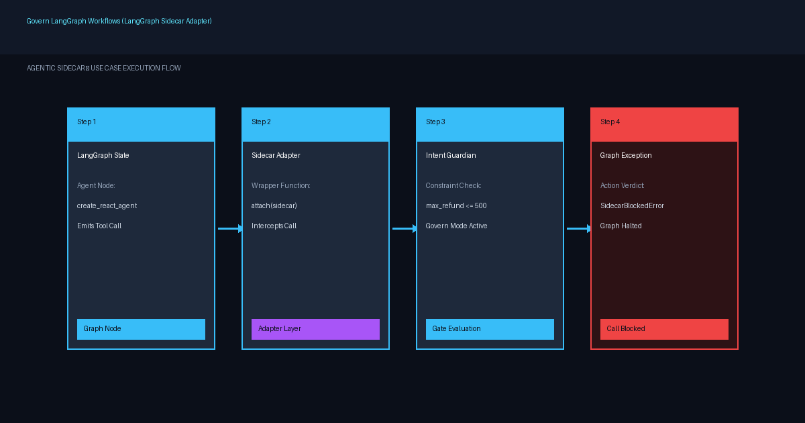

# Govern LangGraph Agent Workflows with Sidecar Adapter

Attach Agentic Sidecar's native LangGraph adapter to intercept graph tool invocations and enforce intent constraints in govern mode without changing core agent logic.

| | |
|---|---|
| **For** | LangGraph agent developers adding real-time decision supervision |
| **Difficulty** | Intermediate |
| **Time** | ~15 minutes |
| **Capabilities** | [LangGraph Adapter](https://deepagentlabs.io/agentic-sidecar/docs/integrations/#langgraph), [Intent Guardian](https://deepagentlabs.io/agentic-sidecar/docs/features/#intent-guardian) |
| **Status** | Stable |

## The problem

LangGraph agents organize complex LLM applications into state graphs where nodes execute tool calls autonomously. While LangGraph provides workflow control, it does not evaluate whether tool parameters chosen by the LLM comply with runtime user authorization limits, financial risk boundaries, or organization policies.

Attempting to embed hardcoded validation logic inside every LangGraph tool or node couples governance rules to agent orchestration. Furthermore, modifying graph nodes directly prevents reusing tools across different security roles or operating modes.

## Architecture



*Figure 1: Agentic Sidecar LangGraph adapter wrapping tool declarations before passing them to a `create_react_agent` state graph.*

## Prerequisites

- Python 3.10+ (Python 3.12 recommended)
- `agentic-sidecar` package with `langgraph` extra dependencies installed:
  ```bash
  pip install "agentic-sidecar[langgraph]"
  ```
- Runnable script: [`examples/langgraph_intent_guardian_govern_mode.py`](https://github.com/DeepAgentLabs/agentic-sidecar/tree/main/examples/langgraph_intent_guardian_govern_mode.py)

## Walkthrough

### 1. Install Required Extra Dependencies

Install `agentic-sidecar` with LangGraph adapter support:

```bash
uv sync --extra langgraph
# Or with pip:
pip install "agentic-sidecar[langgraph]"
```

### 2. Define LangGraph Tool and Scripted Model

Define the target tool `issue_refund` and import LangGraph components:

```python
from langchain_core.messages import AIMessage
from langgraph.prebuilt import create_react_agent

def issue_refund(order_id: str, amount: float) -> str:
    """Issue a refund for an order."""
    return f"refunded ${amount:.2f} for order {order_id}"
```

### 3. Build Intent Envelope and Constraint Bindings

Create an `IntentEnvelope` authorizing refunds up to $500.00 and bind the constraint to the `issue_refund` tool's `amount` argument:

```python
from agentic_sidecar import Sidecar, SidecarBlockedError
from agentic_sidecar.adapters.langgraph import attach
from agentic_sidecar.intent import ConstraintBinding, IntentEnvelope, IntentGuardian, Requester

# Define authorized intent envelope
envelope = IntentEnvelope(
    goal="refund_customer",
    requested_by=Requester(type="human", id="user123"),
    constraints={"maximum_refund": 500.0},
)

# Bind constraint to tool argument
binding = ConstraintBinding(
    constraint="maximum_refund",
    tool="issue_refund",
    arg_name="amount",
    op="lte",
)
guardian = IntentGuardian(envelope, [binding])

# Initialize Sidecar runtime in GOVERN mode
sidecar = Sidecar(
    on_sidecar_failure="fail_closed",
    roles=["policy", "risk", "intent_guardian"],
    intent=guardian,
    mode="govern",
)
```

### 4. Attach Adapter to LangGraph Tools

Wrap the tool array using `attach(sidecar, tools)` before instantiating the LangGraph agent:

```python
# Wrap tools with Agentic Sidecar governance adapter
governed_tools = attach(sidecar, [issue_refund])

# Pass governed tools directly into LangGraph create_react_agent
agent = create_react_agent(model, tools=governed_tools)
```

### 5. Execute Graph and Enforce Governance

Invoke the agent with an out-of-bounds request ($850.00) followed by a valid request ($120.00):

```python
# Attempt 1: $850.00 refund (Exceeds $500.00 limit) -> Raises SidecarBlockedError
try:
    agent.invoke({"messages": [("user", "Refund order A100 for $850.")]})
except SidecarBlockedError as exc:
    print(f"Blocked before tool ran: {exc}")

# Attempt 2: $120.00 refund (Within limit) -> Allowed
result = agent.invoke({"messages": [("user", "Refund order A100 for $120.")]})
print(f"Agent response: {result['messages'][-1].content}")
```

## Expected output

Run the complete runnable example script:

```bash
uv run --extra langgraph python examples/langgraph_intent_guardian_govern_mode.py
```

Console Output:

```
--- Attempt 1: refund of $850 (exceeds the $500 authorization) ---
[GOVERN] BLOCK tool=issue_refund args={'order_id': 'A100', 'amount': 850.0} risk=LOW reason=Intent Guardian: 'amount'=850.0 on 'issue_refund' violates constraint 'maximum_refund' (must be lte 500)
Blocked before the real tool ran: Sidecar blocked 'issue_refund'({'order_id': 'A100', 'amount': 850.0}): Intent Guardian: 'amount'=850.0 on 'issue_refund' violates constraint 'maximum_refund' (must be lte 500)

--- Attempt 2: refund of $120 (within the $500 authorization) ---
Final agent message: Refund issued.

--- Sidecar decision log ---
BLOCK  issue_refund({'order_id': 'A100', 'amount': 850.0})  -- Intent Guardian: 'amount'=850.0 on 'issue_refund' violates constraint 'maximum_refund' (must be lte 500)
ALLOW  issue_refund({'order_id': 'A100', 'amount': 120.0})  -- Policy Advisor: No policy rule matched tool 'issue_refund'; default effect is 'allow'; Risk Evaluator: No risk rule matched tool 'issue_refund'; default risk is 'LOW'; Intent Guardian: No intent constraints violated for 'issue_refund'
```

## Verify it worked

1. Verify that `SidecarBlockedError` is thrown on Attempt 1 ($850.00 refund), preventing tool execution.
2. Confirm that Attempt 2 ($120.00 refund) completes successfully and returns `"Refund issued."`.
3. Check the decision log output to confirm `BLOCK` and `ALLOW` statuses recorded in `sidecar.decisions`.

## Clean up

To remove installed extras or deactivate virtual environment:

```bash
deactivate
```

## Variations and next steps

- **Observe Mode Auditing**: Run in `mode="observe"` first to monitor LangGraph tool calls without blocking graph transitions.
- Learn more in [Integrations Documentation](https://deepagentlabs.io/agentic-sidecar/docs/integrations/#langgraph) and [Features](https://deepagentlabs.io/agentic-sidecar/docs/features/#intent-guardian).

## Tested with

- agentic-sidecar 0.6.0, LangGraph 0.2+, Python 3.12, Ubuntu 24.04, verified 2026-10-07
