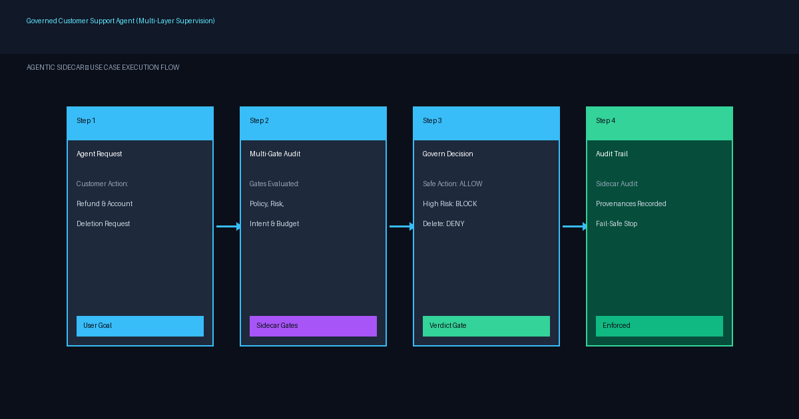

# Run a Governed Customer Support Agent

Combine Policy Advisor, Intent Guardian, Risk Evaluator, and Budget Guardrails into a unified synchronous supervision sidecar to secure enterprise customer support workflows.

| | |
|---|---|
| **For** | Enterprise AI platform engineers deploying production support agents |
| **Difficulty** | Intermediate |
| **Time** | ~15 minutes |
| **Capabilities** | [Policy Advisor](https://deepagentlabs.io/agentic-sidecar/docs/features/#policy-advisor), [Intent Guardian](https://deepagentlabs.io/agentic-sidecar/docs/features/#intent-guardian), [Risk Evaluator](https://deepagentlabs.io/agentic-sidecar/docs/features/#risk-evaluator), [Budget Guardrails](https://deepagentlabs.io/agentic-sidecar/docs/features/#budget-guardrails) |
| **Status** | Stable |

## The problem

Production customer support agents operate with broad toolsets: reading order details, issuing refunds, sending customer communications, and managing customer accounts. Single-layer guardrails (such as system prompt instructions or isolated regex filters) leave multiple attack surfaces exposed:

1. **Destructive Actions**: Rogue calls to delete customer records or wipe databases.
2. **Financial Drift**: Issuing refunds above specific user intent limits authorized by tier leads.
3. **High-Risk Operations**: Triggering unreviewed tier-2 operations without escalation.
4. **Cost Runaways**: Infinite agent loops consuming excessive API budget.

Building custom checks across each tool function results in tangled, duplicate code that is difficult to maintain or audit.

## Architecture



*Figure 1: Multi-layer Agentic Sidecar decision pipeline evaluating agent actions across Policy, Risk, Intent, and Budget gates.*

## Prerequisites

- Python 3.10+ (Python 3.12 recommended)
- `agentic-sidecar` v`0.6.0` installed
- Runnable script: [`examples/governed_customer_support_agent.py`](https://github.com/DeepAgentLabs/agentic-sidecar/tree/main/examples/governed_customer_support_agent.py)

## Walkthrough

### 1. Define Support Agent Tools

Create standard support agent tools for order retrieval, refund issuance, and record deletion:

```python
def read_order(order_id: str) -> dict:
    """Retrieve order details by order ID."""
    print(f"  [EXEC] Executing read_order('{order_id}')...")
    return {"order_id": order_id, "amount": 450.0, "status": "delivered"}

def issue_refund(order_id: str, amount: float, reason: str = "customer dispute") -> dict:
    """Issue a monetary refund to customer."""
    print(f"  [EXEC] Executing issue_refund('{order_id}', amount=${amount})...")
    return {"status": "refund_processed", "order_id": order_id, "refund_amount": amount}

def delete_customer_record(customer_id: str) -> dict:
    """Permanently delete a customer record from database."""
    print(f"  [EXEC] Executing delete_customer_record('{customer_id}')...")
    return {"status": "deleted", "customer_id": customer_id}
```

### 2. Configure Multi-Gate Supervision Rules

Define policies for account deletion, financial risk thresholds, user intent envelopes, and budget limits:

```python
from agentic_sidecar import Sidecar, SidecarBlockedError
from agentic_sidecar.adapters.langgraph import attach
from agentic_sidecar.gate import BudgetGuardian
from agentic_sidecar.gate.policy import PolicyAdvisor, PolicyRule
from agentic_sidecar.gate.risk import RiskEvaluator, RiskRule
from agentic_sidecar.intent import ConstraintBinding, IntentEnvelope, IntentGuardian, Requester

# Policy: Hard DENY on database deletions
policy = PolicyAdvisor(rules=[
    PolicyRule(tool="delete_*", effect="deny", reason="Account deletion requires explicit admin authorization")
])

# Risk: Classify refunds over $500 as HIGH risk
risk = RiskEvaluator(rules=[
    RiskRule(tool="issue_refund", arg_name="amount", arg_op="gt", arg_value=500.0, risk="HIGH", reason="Refund exceeds threshold ($500)")
])

# Intent: User requested refund up to $500
envelope = IntentEnvelope(
    goal="Assist customer with order dispute up to $500",
    requested_by=Requester(type="human", id="support_lead_42"),
    constraints={"maximum_refund": 500.0}
)
intent_bindings = [
    ConstraintBinding(constraint="maximum_refund", tool="issue_refund", arg_name="amount", op="lte", severity="BLOCK")
]
guardian = IntentGuardian(envelope, intent_bindings)

# Budget: $5.00 spend ceiling
budget = BudgetGuardian(max_cost=5.00)
```

### 3. Initialize Sidecar in Observe Mode (Phase 1)

Instantiate `Sidecar` in `observe` mode to audit actions without blocking execution:

```python
sidecar_observe = Sidecar(
    on_sidecar_failure="fail_closed",
    mode="observe",
    roles=["policy", "risk", "intent_guardian", "budget"],
    policy=policy,
    risk=risk,
    intent=guardian,
    budget=budget,
    risk_block_threshold="HIGH",
)

obs_read, obs_refund, obs_delete = attach(sidecar_observe, [read_order, issue_refund, delete_customer_record])

# Execute actions in Observe Mode
obs_read("ORD-999")
obs_refund("ORD-999", 850.0)  # Exceeds limit; logged as BLOCK but allowed to run in observe mode
```

### 4. Transition to Govern Mode (Phase 2)

Instantiate `Sidecar` in `govern` mode for active enforcement:

```python
sidecar_govern = Sidecar(
    on_sidecar_failure="fail_closed",
    mode="govern",
    roles=["policy", "risk", "intent_guardian", "budget"],
    policy=policy,
    risk=risk,
    intent=guardian,
    budget=BudgetGuardian(max_cost=5.00),
    risk_block_threshold="HIGH",
)

gov_read, gov_refund, gov_delete = attach(sidecar_govern, [read_order, issue_refund, delete_customer_record])

# Valid read order
gov_read("ORD-999")

# Unauthorized refund ($850.0) -> BLOCKED
try:
    gov_refund("ORD-999", 850.0)
except SidecarBlockedError as exc:
    print(f"🛑 BLOCKED BY SIDECAR: {exc}")

# Forbidden deletion -> BLOCKED
try:
    gov_delete("cust_1001")
except SidecarBlockedError as exc:
    print(f"🛑 BLOCKED BY SIDECAR: {exc}")
```

## Expected output

Run the official example script directly from the codebase:

```bash
python examples/governed_customer_support_agent.py
```

Console Output:

```
================================================================================
      GOVERNED CUSTOMER SUPPORT AGENT — SIDECAR USE CASE DEMO
================================================================================
--- PHASE 1: OBSERVE MODE (Monitoring & Logging Only) ---
1.1 Agent calls read_order('ORD-999'):
INFO [agentic_sidecar] [OBSERVE] ALLOW tool=read_order args={'order_id': 'ORD-999'} risk=LOW reason=...
  [EXEC] Executing read_order('ORD-999')...

1.3 Agent calls issue_refund('ORD-999', amount=850.0) [Exceeds Limit]:
ERROR [agentic_sidecar] [OBSERVE] BLOCK tool=issue_refund args={'order_id': 'ORD-999', 'amount': 850.0} risk=HIGH reason=Risk Evaluator: Refund exceeds standard support representative threshold ($500)
  [EXEC] Executing issue_refund('ORD-999', amount=$850.0)...

================================================================================
--- PHASE 2: GOVERN MODE (Active Policy & Intent Enforcement) ---
================================================================================
2.1 Agent calls read_order('ORD-999'):
  [EXEC] Executing read_order('ORD-999')...
  -> Result: {'order_id': 'ORD-999', 'customer_id': 'cust_1001', 'amount': 450.0, 'status': 'delivered'}

2.3 Agent calls issue_refund('ORD-999', amount=850.0) [Intent Violation]:
ERROR [agentic_sidecar] [GOVERN] BLOCK tool=issue_refund args={'order_id': 'ORD-999', 'amount': 850.0} risk=HIGH reason=Risk Evaluator: Refund exceeds standard support representative threshold ($500)
  🛑 BLOCKED BY SIDECAR: Sidecar blocked 'issue_refund'({'order_id': 'ORD-999', 'amount': 850.0}): Risk Evaluator: Refund exceeds standard support representative threshold ($500)

2.4 Agent calls delete_customer_record('cust_1001') [Policy Violation]:
ERROR [agentic_sidecar] [GOVERN] BLOCK tool=delete_customer_record args={'customer_id': 'cust_1001'} risk=None reason=Policy Advisor: Account deletion requires explicit admin authorization
  🛑 BLOCKED BY SIDECAR: Sidecar blocked 'delete_customer_record'({'customer_id': 'cust_1001'}): Policy Advisor: Account deletion requires explicit admin authorization

Sidecar Audit Summary:
Total Interceptions: 4
  Allowed Actions: 2
  Blocked Actions: 2
================================================================================
```

## Verify it worked

1. Confirm that Phase 1 (Observe Mode) logs `BLOCK` status while permitting function execution (`[EXEC]` printed).
2. Confirm that Phase 2 (Govern Mode) intercepts unauthorized calls before execution (`[EXEC]` not printed, `SidecarBlockedError` caught).
3. Inspect `sidecar_govern.decisions` to verify decision provenance for all 4 tool calls.

## Clean up

To remove the repository copy or clean the Python virtual environment:

```bash
deactivate
```

## Variations and next steps

- **Inspect Decision Provenance**: Access full decision histories via `sidecar.decisions` for audit exports.
- **Budget Escalation**: Combine Budget Guardian with human-in-the-loop escalation workflows.
- Explore full details in [Configuration Reference](https://deepagentlabs.io/agentic-sidecar/docs/configuration/) and [API Reference](https://deepagentlabs.io/agentic-sidecar/docs/api-reference/).

## Tested with

- agentic-sidecar 0.6.0, Python 3.12, Ubuntu 24.04, verified 2026-10-07
