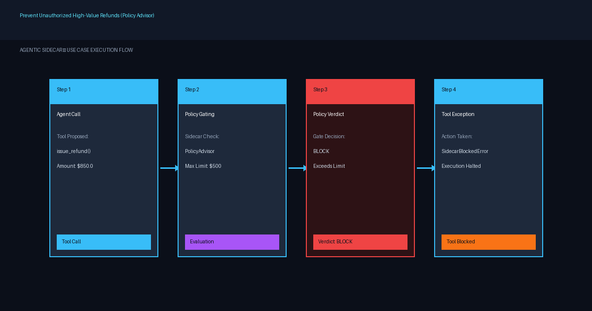

# Prevent Unauthorized High-Value Refunds

Intercept agent tool calls and enforce policy limits to block unauthorized monetary refunds in under 10 minutes.

| | |
|---|---|
| **For** | AI agent developers building financial, e-commerce, or customer service tools |
| **Difficulty** | Beginner |
| **Time** | ~10 minutes |
| **Capabilities** | [Policy Advisor](https://deepagentlabs.io/agentic-sidecar/docs/features/#policy-advisor) |
| **Status** | Stable |

## The problem

Autonomous LLM agents handling e-commerce or customer support requests are frequently empowered to invoke payment gateway tools such as `issue_refund`. Prompt-based guardrails ("Do not issue refunds above $500") are nondeterministic and vulnerable to prompt injection or LLM reasoning failures. When an agent hallucinates or follows a rogue prompt, unauthorized funds leave the organization instantly.

Existing approaches rely on wrapping tool functions with manual `if amount > 500:` checks inside application logic, which bloats business code, lacks central audit capabilities, and fails to handle mode transitions (such as shadow auditing vs. active enforcement).

## Architecture



*Figure 1: Agentic Sidecar Policy Advisor intercepting `issue_refund` calls and enforcing policy rules in govern mode.*

## Prerequisites

- Python 3.10 or higher (Python 3.12 recommended)
- `agentic-sidecar` package version `0.6.0` or higher
- No external services or API keys required (runs completely local and deterministic)

## Walkthrough

### 1. Install Agentic Sidecar

Install the `agentic-sidecar` package via `pip` in a clean virtual environment:

```bash
pip install agentic-sidecar
```

### 2. Define the Agent Tool Function

Define a standard Python tool representing the refund execution tool:

```python
def issue_refund(order_id: str, amount: float, reason: str = "customer dispute") -> dict:
    """Issue a monetary refund to a customer."""
    print(f"[EXEC] Executing issue_refund('{order_id}', amount=${amount:.2f})...")
    return {
        "status": "refund_processed",
        "order_id": order_id,
        "refund_amount": amount,
        "reason": reason,
    }
```

### 3. Configure Policy Advisor and Sidecar Runtime

Create a `PolicyAdvisor` rule that restricts monetary refunds to $500.00 and attach it to a `Sidecar` instance in `govern` mode:

```python
from agentic_sidecar import Sidecar, SidecarBlockedError
from agentic_sidecar.adapters.langgraph import attach
from agentic_sidecar.gate.risk import RiskEvaluator, RiskRule

# Define risk policy rule: HIGH risk on refunds exceeding $500.00
risk_policy = RiskEvaluator(
    rules=[
        RiskRule(
            tool="issue_refund",
            arg_name="amount",
            arg_op="gt",
            arg_value=500.0,
            risk="HIGH",
            reason="Refund amount exceeds standard support threshold ($500.00)",
        )
    ]
)

# Initialize Sidecar in govern mode with fail_closed protection
sidecar = Sidecar(
    on_sidecar_failure="fail_closed",
    mode="govern",
    roles=["risk"],
    risk=risk_policy,
    risk_block_threshold="HIGH",
)

# Attach Sidecar governance to the tool
wrapped_tools = attach(sidecar, [issue_refund])
governed_refund = wrapped_tools[0]
```

### 4. Execute Within Authorized Policy ($300.00)

Invoke the governed tool with a refund amount within policy limits ($300.00):

```python
print("--- Test 1: Valid Refund ($300.00) ---")
result = governed_refund("ORD-101", 300.0)
print(f"Result: {result}")
```

### 5. Execute Beyond Policy Limit ($850.00)

Invoke the governed tool with a refund exceeding policy limits ($850.00) to observe enforcement:

```python
print("\n--- Test 2: Unauthorized Refund ($850.00) ---")
try:
    governed_refund("ORD-101", 850.0)
except SidecarBlockedError as exc:
    print(f"🛑 BLOCKED BY SIDECAR: {exc}")
```

## Expected output

When running the complete walkthrough script, Agentic Sidecar allows valid requests and blocks policy violations:

```
--- Test 1: Valid Refund ($300.00) ---
INFO [agentic_sidecar] [GOVERN] ALLOW tool=issue_refund args={'order_id': 'ORD-101', 'amount': 300.0, 'reason': 'customer dispute'} risk=LOW reason=Risk Evaluator: No risk rule matched tool 'issue_refund'; default risk is 'LOW'
[EXEC] Executing issue_refund('ORD-101', amount=$300.00)...
Result: {'status': 'refund_processed', 'order_id': 'ORD-101', 'refund_amount': 300.0, 'reason': 'customer dispute'}

--- Test 2: Unauthorized Refund ($850.00) ---
ERROR [agentic_sidecar] [GOVERN] BLOCK tool=issue_refund args={'order_id': 'ORD-101', 'amount': 850.0, 'reason': 'customer dispute'} risk=HIGH reason=Risk Evaluator: Refund amount exceeds standard support threshold ($500.00) (risk >= block threshold 'HIGH')
🛑 BLOCKED BY SIDECAR: Sidecar blocked 'issue_refund'({'order_id': 'ORD-101', 'amount': 850.0, 'reason': 'customer dispute'}): Risk Evaluator: Refund amount exceeds standard support threshold ($500.00) (risk >= block threshold 'HIGH')
```

## Verify it worked

To verify successful governance enforcement:
1. Confirm that `issue_refund` executes and returns `status: refund_processed` when `amount <= 500.0`.
2. Confirm that `SidecarBlockedError` is raised immediately when `amount > 500.0`.
3. Verify that the inner `issue_refund` Python function print line `[EXEC]` is **never printed** during the blocked invocation, proving execution was halted prior to tool invocation.

## Clean up

No external services or state persistent storage are created by this walkthrough. To remove temporary artifacts:

```bash
# Deactivate and delete virtual environment if created
deactivate
rm -rf .venv
```

## Variations and next steps

- **Switch to Observe Mode**: Change `mode="observe"` during initial staging to log policy violations without throwing exceptions.
- **YAML Rule Files**: Load policies dynamically from external YAML rule files using `PolicyAdvisor.from_yaml("policy.yaml")`.
- Learn more about policy rule syntax in [Policy Advisor Documentation](https://deepagentlabs.io/agentic-sidecar/docs/features/#policy-advisor).

## Tested with

- agentic-sidecar 0.6.0, Python 3.12, Ubuntu 24.04, verified 2026-10-07
